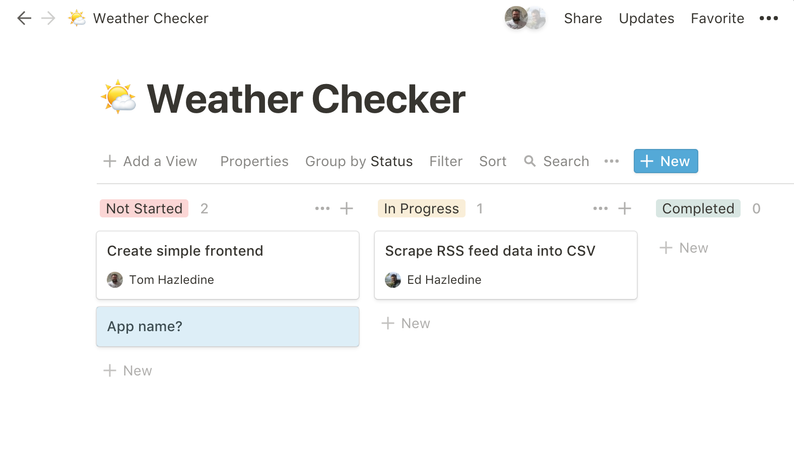

Ed and Tom kick off their new side hustle - as chosen by their rabid fanbase. The plan is to document the "behind the scenes" parts of programming: what does collaboration actually look like? And what actually happens at the beginning of a new project? Find out in this week's invigorating instalment of A Question of Code!

## Links from this episode

* Notion: [https://www.notion.so/](https://www.notion.so/)
* Postman App: [Postman App](https://www.getpostman.com/)
* Our Notion board:

